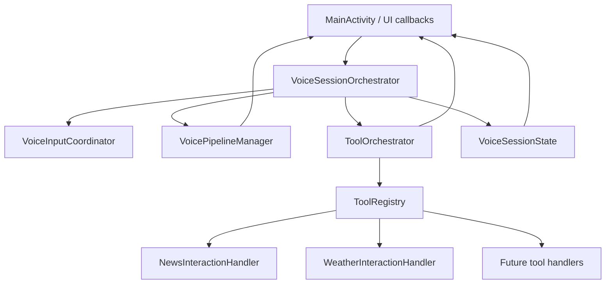

# Voice Refactor Next Plan

这份计划基于当前代码状态制定。前一轮已经完成了语音输入启动收口、工具交互状态协调、工具结果模型统一和一批单元测试；下一步目标是继续减少 `MainActivity` 的编排职责，让后续新增工具时主要扩展独立组件，而不是继续把逻辑塞回 Activity。

## 当前状态

已完成：

- `VoiceInputCoordinator`：统一管理 mic 启动请求、权限、耳机、realtime pending、连续监听和文字模式保护。
- `VoicePipelineManager`：聚合工具 TTS 与 realtime output 协调。
- `ToolInteractionCoordinator`：统一新闻/天气工具交互生命周期，包含 ack、fetch、interrupt 和 stale token 防护。
- `ToolInteractionResult<T>`：统一工具成功/失败返回结构。
- `NewsInteractionHandler` / `WeatherInteractionHandler`：把工具调用结果包装成统一结果模型。
- 单元测试覆盖核心边界：语音输入、工具交互、工具 handler、PCM buffer、pending broadcast、prompt memory。

仍未完成：

- `MainActivity` 仍然是事实上的 runtime orchestrator，保留了 UI、副作用、工具路由、状态字符串、realtime 开关、卡片展示等大量细节。
- `setState(String)` 仍依赖字符串状态，无法从类型层面阻止非法状态组合。
- 工具接入还不是 registry/plugin 结构，新增工具仍需要改 MainActivity 的路由、展示、fact update、TTS 等位置。
- 天气定位权限、工具卡片缓存、pending fact broadcast 等仍是分散字段和分散流程。

## 目标架构



期望边界：

- `MainActivity` 负责 Android lifecycle、页面渲染、权限弹窗、toast/dialog 这类 Android UI 副作用。
- `VoiceSessionOrchestrator` 负责一次语音会话的高层编排：输入、输出、工具、状态切换。
- `VoiceSessionState` 负责统一可见状态和内部状态，替代散落的字符串判断。
- `ToolOrchestrator` / `ToolRegistry` 负责工具发现、路由、执行、结果展示策略、fact 注入和 TTS answer。

## 阶段 1：状态模型类型化

目标：替换 `setState(String)` 里分散的字符串状态，先建立一个类型化状态模型。

建议新增：

- `VoiceSessionState`
- `VoiceSessionStatus`
- `VoiceSessionStateReducer`

第一步不需要一次性改完整 Activity，可以先让 `setState(String)` 变成兼容层：

- 外部旧调用暂时保留。
- 内部立刻转换成 enum。
- UI label、按钮文案、keep screen on、response pending timeout 从 enum 派生。

验收标准：

- `stateLabelText()` 不再直接比较 `"news_tool"` / `"speaking"` / `"processing"` 等字符串。
- `isResponsePendingState()` 改为基于 enum。
- 新增单元测试覆盖状态转换、label、keep screen on、按钮文案。
- 真机验证：语音、文字、新闻、天气、初始化流程状态展示不退化。

风险：

- 状态字符串当前被很多 UI 和 runtime 逻辑共用，迁移时要保持兼容层，避免一次性大改。

## 阶段 2：抽出 VoiceSessionOrchestrator

目标：让 MainActivity 不再直接串联 input、realtime output、tool TTS、pending broadcast 的高层顺序。

建议职责：

- 接收 UI intent：进入文字模式、进入语音模式、点击 mic、助手唤醒、耳机绑定完成。
- 调用 `VoiceInputCoordinator` 发起或停止输入。
- 调用 `VoicePipelineManager` 处理 realtime output 和 tool TTS。
- 协调 `PendingBroadcastCoordinator` 与工具结果注入。
- 输出简洁事件给 MainActivity：更新状态、渲染卡片、播放 toast、请求权限。

迁移顺序：

1. 先迁移 `toggleMic()` 中的高层分支。
2. 再迁移 `onRealtimeReady()` 和 `handleRealtimeOutputFinished()`。
3. 最后迁移 `interruptNewsPlayback()` / `interruptWeatherPlayback()`。

验收标准：

- `MainActivity.toggleMic()` 只转发一个 intent，不再直接判断新闻/天气/TTS/realtime。
- `onRealtimeReady()` 中工具、pending text、pending voice start 的顺序由 orchestrator 决定。
- 现有 `VoiceInputCoordinatorTest` 和 `ToolInteractionCoordinatorTest` 保持通过，并新增 orchestrator 级单测。

风险：

- 这里最容易引入“AI 说完后没有回 listening”或“工具 TTS 与 realtime overlap”的回归。必须小步提交，每步真机验证。

## 阶段 3：工具注册与统一工具会话

目标：为后续大量工具集成做准备，新增工具时不再反复修改 MainActivity 的核心流程。

建议新增：

- `ToolDefinition`
- `ToolRegistry`
- `ToolSession`
- `ToolResultPresenter`

建议接口：

```java
interface ToolDefinition<I, O> {
    String id();
    boolean matches(String text);
    void execute(I input, ToolCallback<O> callback);
    ToolInteractionResult<O> toResult(String question, O output);
}
```

迁移顺序：

1. 先把 news/weather 都包成 `ToolDefinition`。
2. 把 `handleNewsQuestion()` / `handleWeatherQuestion()` 收到 `ToolRegistry` 或 `ToolRouter`。
3. 把 `addNewsCard()` / `addWeatherCard()` 的展示策略收进 `ToolResultPresenter`。
4. 把 fact update 和 pending broadcast 与工具 id 绑定。

验收标准：

- 新增一个工具时，只需要新增 tool、handler、card/presenter、测试，不需要改 MainActivity 的主流程。
- 新闻和天气共享同一套 result -> card -> TTS -> fact update 流程。
- 工具失败文案、fact、answer 都由工具定义或 handler 生成。

风险：

- 天气有定位权限和“复用最近天气 fact”的特殊流程，第一版 registry 需要允许工具自带 preflight。

## 阶段 4：天气定位流程收口

目标：把定位权限、pending weather request、location fallback 从 MainActivity 中移出。

建议新增：

- `WeatherRequestCoordinator`
- `LocationPermissionDelegate`

迁移内容：

- `pendingWeatherQuestion`
- `pendingWeatherRealtime`
- `pendingWeatherToken`
- `requestWeatherForCurrentLocation()`
- location permission result handling

验收标准：

- MainActivity 的 `onRequestPermissionsResult()` 只把权限结果转发给对应 coordinator。
- 天气工具单测覆盖：无权限、授权后继续、拒绝权限、有 last location、single location 失败。

风险：

- Android permission API 仍必须从 Activity 发起，因此需要保留 delegate 边界，而不是把 Android API 硬塞进纯 Java coordinator。

## 阶段 5：MainActivity 瘦身与边界清理

目标：把 MainActivity 从 3000+ 行逐步降下来，让它成为 UI shell。

建议拆分：

- `MemoryCoordinator`：初始化 profile、prompt memory、summary、SQLite 写入。
- `ChatController`：文字聊天发送、消息渲染前的数据处理。
- `VoiceCardController`：天气/新闻语音卡片缓存和 timeout。
- `HeadsetController`：耳机绑定提示、demo mode、断开处理。

验收标准：

- MainActivity 不再直接维护大量工具和语音字段。
- 每个 controller 都有纯 Java 单测或小范围 Android 边界测试。
- MainActivity 中保留 lifecycle、view render、permission/dialog/toast glue code。

风险：

- 记忆和初始化流程耦合最大，应最后拆。

## 建议执行顺序

1. 状态模型类型化。
2. `VoiceSessionOrchestrator` 接管 `toggleMic()`、`onRealtimeReady()`、`handleRealtimeOutputFinished()`。
3. `ToolRegistry` / `ToolSession` 统一新闻和天气工具。
4. 天气定位流程独立。
5. 拆 `MemoryCoordinator`、`VoiceCardController`、`HeadsetController`。

## 每步通用验证清单

- 跑单测：`gradle :app:testDebugUnitTest`
- 编译 debug：`gradle :app:assembleDebug`
- 真机验证文字模式：进入文字模式后 mic 关闭，返回语音模式后自动监听。
- 真机验证普通语音：用户说话、AI 回复、回复结束后回 listening。
- 真机验证工具：天气、天气追问复用、新闻播报、工具 TTS 结束后回 listening。
- 真机验证打断：AI 说话时点 mic、工具播报时点 mic、耳机断开、demo mode 切换。

## 暂不做的事

- 不改底层 `RealtimeClient` 协议，除非网关行为变化。
- 不把 Android permission/dialog 直接塞进纯 Java coordinator。
- 不一次性重写 MainActivity；继续按可测试的小步迁移。
- 不在工具 registry 第一版追求完全通用，先服务 news/weather 和下一个真实工具。
