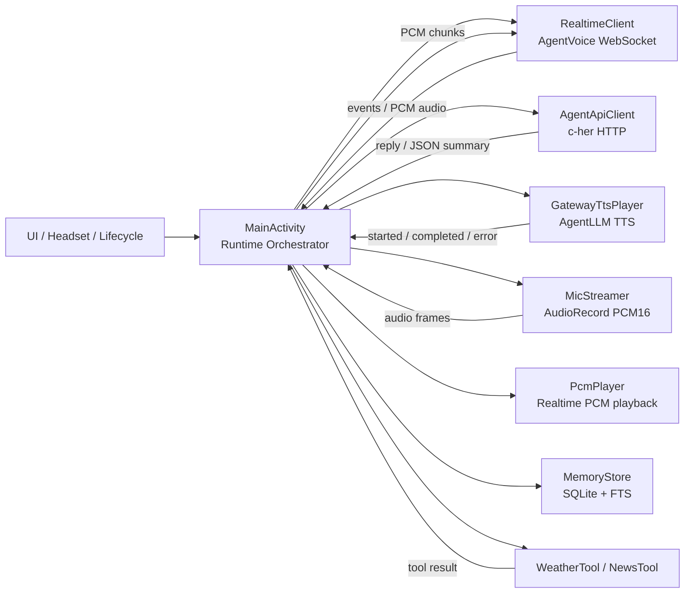
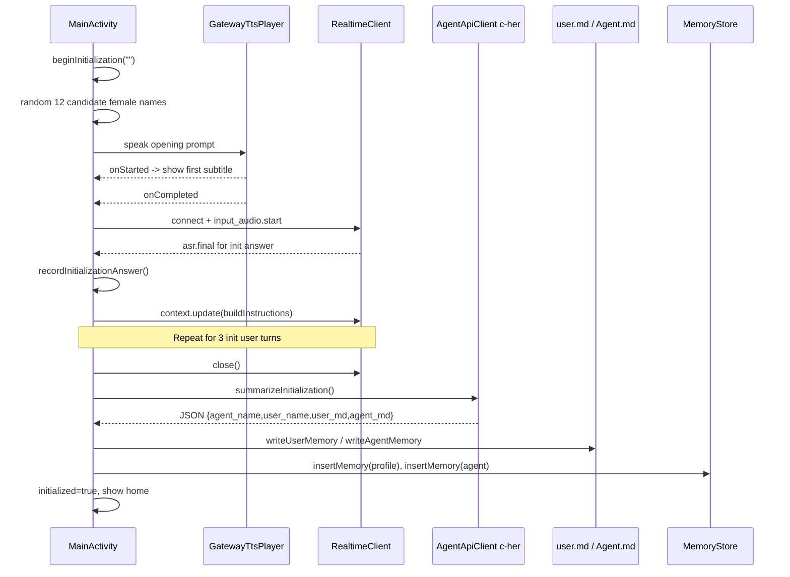
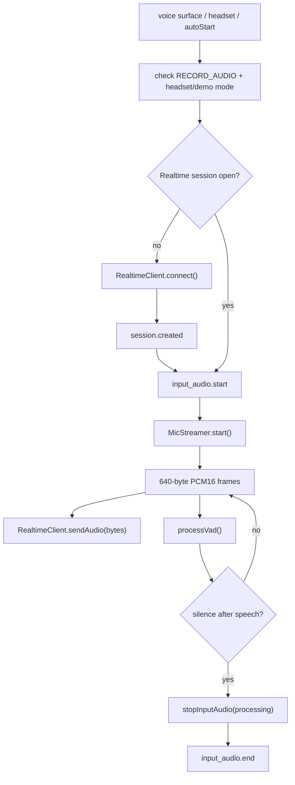
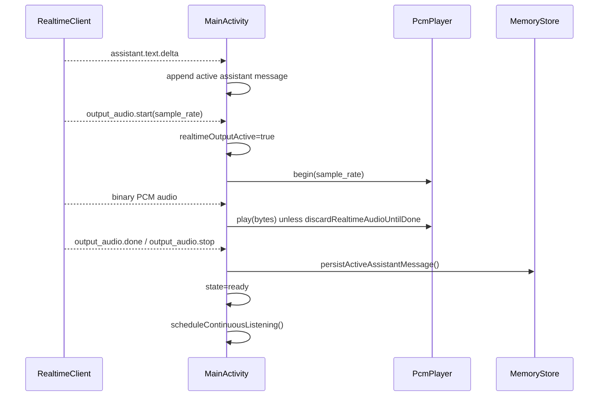
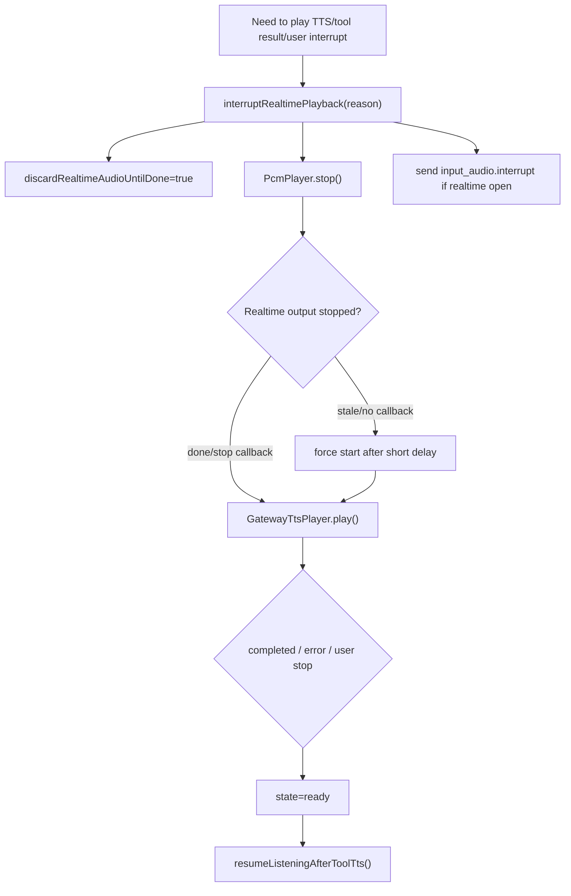
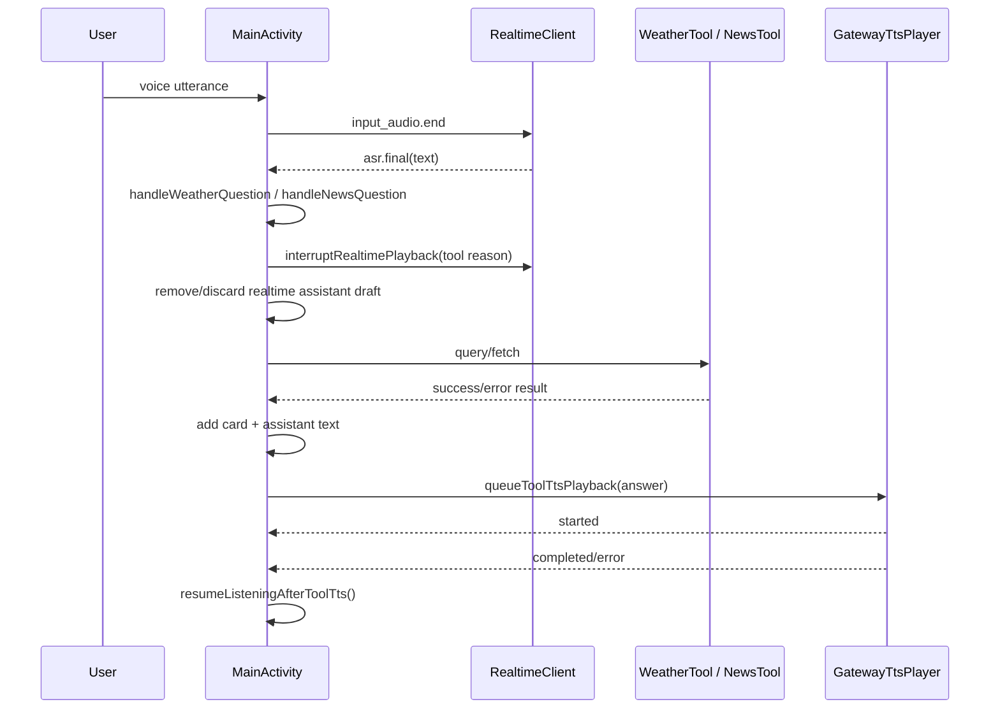
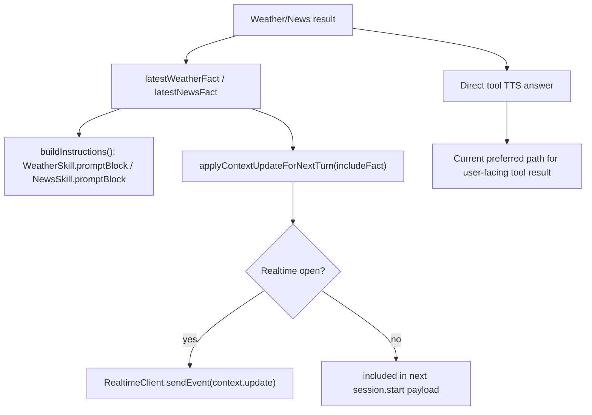
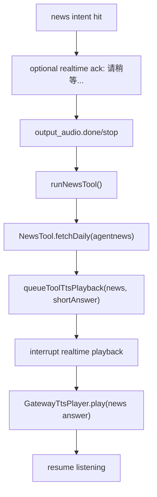
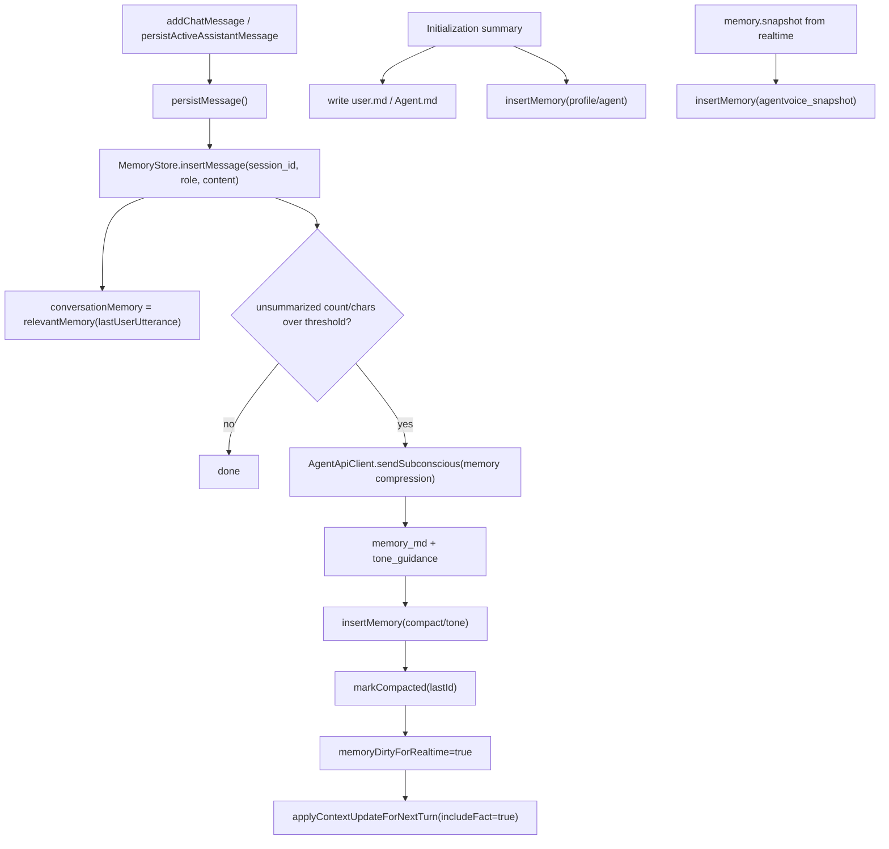

# Voice Runtime Architecture

这份文档描述当前 Android 端的语音运行时边界。目标是把 `RealtimeClient`、`AgentApiClient`、`GatewayTtsPlayer`、麦克风、播放、工具、fact update 和记忆落盘的职责拆清楚，方便后续继续把 `MainActivity` 里的编排逻辑抽成更小的 controller。

## 模块边界

| 模块 | 当前职责 | 主要调用方 |
| --- | --- | --- |
| `MainActivity` | 运行时编排、UI 状态机、工具路由、记忆写入入口 | Android lifecycle / UI / headset |
| `RealtimeClient` | AgentVoice realtime WebSocket，负责 session、事件、PCM 输入输出 | `MainActivity` |
| `AgentApiClient` | c-her HTTP chat/completions，负责文本聊天、潜意识总结、工具路由、记忆压缩 | `MainActivity` |
| `GatewayTtsPlayer` | AgentLLM TTS HTTP 生成 MP3，并用 `MediaPlayer` 播放 | `MainActivity` |
| `MicStreamer` | `AudioRecord` 采集 16 kHz PCM，带 AEC/NS/AGC | `MainActivity` |
| `PcmPlayer` | 播放 realtime 返回的 PCM16 音频流 | `MainActivity` |
| `WeatherTool` / `NewsTool` | 客户端直接调用天气/新闻数据源 | `MainActivity` |
| `MemoryStore` | SQLite messages/memories/FTS，保存会话、摘要、profile 索引 | `MainActivity` |

## 总体调用管理

`MainActivity` 现在仍然是编排中心。底层调用已经分别由 `RealtimeClient`、`AgentApiClient`、`GatewayTtsPlayer` 承担；后续最值得抽离的是 `MainActivity` 中的 runtime orchestration，而不是再改底层 client。

## 1. Initial 阶段

初始化目标是生成长期 profile：`user.md`、`Agent.md`、SQLite profile/agent memory，并把 Agent 名字、用户名字和关系设定保存下来。

关键点：

- 开场主动语音由 `GatewayTtsPlayer` 播放，不依赖 realtime 先发言。
- 初始化对话仍使用 realtime 收音和 ASR。
- 第三个用户回答后，客户端关闭 realtime，把 transcript 交给 c-her 潜意识模型整理。
- 写入顺序是文件和 SharedPreferences，再落 SQLite profile/agent memory。

## 2. 正常语音对话阶段

### 麦克风管线

当前 UI 中 `processing` 表示“用户说完，等待 ASR/final 或模型回复”，不再暴露为 `Thinking`。

### Realtime 回复与播放管线

### 语音播放与打断管线

设计原则：

- realtime PCM 和 TTS 不能重叠。
- 工具 TTS 请求开始时就算 active，不等 `MediaPlayer.start()`。
- 如果 realtime 的 stop/done 回调丢失或来自 stale socket，短延迟后强制启动工具 TTS，并继续丢弃后续 realtime audio。

## 3. 包含调用工具的对话

天气和新闻都走“客户端工具结果 + TTS 播报”，避免 realtime 模型编造结果。

### Fact update 管线

当前用户可听见的工具结果优先走 Direct TTS；fact update 主要用于保持 realtime 后续上下文一致，避免它在下一轮否认或编造工具结果。

### 新闻工具特殊链路

## 记忆落盘管线

注意：

- 普通消息只有初始化完成后才进入 SQLite。
- 工具 fact 是 transient memory，`MemoryStore` 检索时会过滤，避免天气/新闻旧结果污染长期记忆。
- `memory.snapshot` 会写入 SQLite，但在 prompt 检索中排除 `agentvoice_snapshot`，避免把完整 realtime prompt 反复注入。

## 后续代码整理建议

建议按风险从低到高拆分：

1. `ToolTtsCoordinator`
   管理 `pendingToolTtsId/text`、`toolTtsPlaybackActive`、force-start、resume listening 回调。这个边界最清楚，也最能减少 TTS/realtime overlap bug。

2. `VoiceInputController`
   管理 `MicStreamer`、VAD、`input_audio.start/end`、foreground service、`processing/listening` 状态。

3. `RealtimeTurnController`
   管理 realtime output lifecycle：`activeAssistantId`、`realtimeOutputActive`、`discardRealtimeAudioUntilDone`、PCM playback、interrupt。

4. `ToolRouter`
   管理 news/weather intent、工具执行、卡片、fact update、TTS answer。

5. `MemoryCoordinator`
   管理 `persistMessage`、`maybeCompactMemory`、初始化写档、SQLite memory/fact filtering。

拆分顺序不要反过来。先抽 TTS 和输入/输出管线，最后再抽记忆，因为记忆依赖 profile、prompt、消息和工具过滤，耦合面最大。
